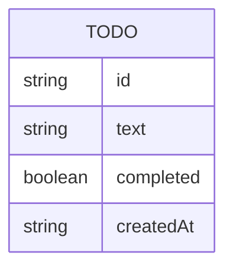

# Domain Model

A single entity: the todo item a visitor adds to their list. It exists only in
the visitor's own browser (local storage) — there is no server-side store.

- `id` — a client-generated unique identifier (e.g. a UUID).
- `text` — the short label the visitor typed; never empty or whitespace-only.
- `completed` — whether the visitor has marked it done; toggles back and forth.
- `createdAt` — when it was added, used to keep the list in add order.